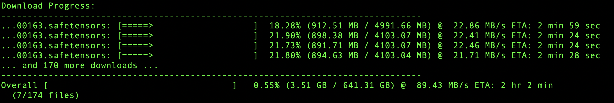

# 100% AI Generated

This software code was generated 100% using AI tools such as Google Gemini 2.5 Pro and Claude Sonnet 4.
Please be aware of potential legal risks associated with using AI-generated code, including but not limited to copyright infringement or lack of ownership.


# DL

DL is a command-line tool written in Go for downloading multiple files concurrently from a list of URLs or a Hugging Face repository. It features a dynamic progress bar display for each download, showing speed, percentage, and downloaded/total size. The tool supports advanced Hugging Face repository handling, including interactive selection of specific `.gguf` files or series.



## Quick Start

1. **Build the tool:**
    ```bash
    build.sh
    ```
2. **Download from a URL list:**
    ```bash
    ./dl -f ../download_links.txt -c 4
    ```
3. **Download from a Hugging Face repo:**
    ```bash
    ./dl -hf "Qwen/Qwen3-30B-A3B"
    ```
4. **Select a GGUF file/series from a Hugging Face repo:**
    ```bash
    ./dl -hf "unsloth/DeepSeek-R1-0528-GGUF"" -select
    ```

### Features

*   **Concurrent Downloads:** Downloads multiple files at the same time, configurable via the `-c` flag, with different caps for file list vs. Hugging Face downloads.
*   **Multiple Input Sources:** Supports downloading from a list of URLs in a text file (`-f`) or automatically fetching all files from a specified Hugging Face repository (`-hf`).
*   **Hugging Face GGUF Selection:** With the `-select` flag (Hugging Face only), you can interactively select a specific `.gguf` file or a multi-part GGUF series to download from repositories that primarily contain GGUF files.
*   **Dynamic Progress Bars:** Displays a dynamic progress bar for each active download, including:
    *   Filename (truncated for display if too long).
    *   Visual progress bar.
    *   Percentage completion.
    *   Downloaded size / Total size (in MB or GB).
    *   Current download speed (B/s, KB/s, or MB/s).
    *   Estimated Time of Arrival (ETA).
    *   Handles indeterminate progress (when total file size is unknown) with a spinner.
    *   Overall progress summary.
*   **Pre-scanning:** Performs a quick HEAD request for each URL to attempt to determine file size before starting the download.
*   **Organized Output:** Saves downloaded files into a `downloads/` subdirectory. When downloading from a Hugging Face repository, files are saved into a subdirectory named after the repository (e.g., `downloads/owner_repo`). For Hugging Face, subdirectories within the repo are preserved, so original folder structure is maintained.
*   **Error Handling:** Reports common download errors (HTTP issues, file creation problems) directly in the progress display.
*   **Filename Derivation:** Attempts to derive a sensible filename from the URL or Hugging Face metadata. Handles common patterns like `?download=true` suffixes and generates unique names if necessary. For Hugging Face, original repo paths are preserved.
*   **Clean UI:** Uses ANSI escape codes to update progress bars in place, providing a clean terminal interface.
*   **Debug Logging:** Optional debug logging to `log.log` via the `-debug` flag.
*   **Cross-Platform:** Works on Windows, macOS, and Linux.


### Command-Line Arguments

> **Note:** You must provide either the `-f` flag or the `-hf` flag, but not both.

*   `-c <concurrency_level>`: (Optional) Sets the number of concurrent downloads. Defaults to `3`. When using `-hf`, concurrency is capped at 4. When using `-f`, concurrency is capped at 100.
*   `-f <path_to_urls_file>`: (Required if `-hf` is not used) The path to a text file containing URLs, one per line.
*   `-hf <repo_input>`: (Required if `-f` is not used) The Hugging Face repository ID (e.g., `owner/repo_name`) or a full `https://huggingface.co/owner/repo_name` URL. Downloads all files from the main branch of the specified repository.
*   `-select`: (Optional, Hugging Face only) If the repository contains mostly `.gguf` files, allows you to interactively select a specific GGUF file or series to download.
*   `-debug`: (Optional) Enables debug logging to `log.log`.

---

## License

This project is licensed under the MIT License. See the [LICENSE](LICENSE) file for details.